[//]: # ([![Review Assignment Due Date]&#40;https://classroom.github.com/assets/deadline-readme-button-24ddc0f5d75046c5622901739e7c5dd533143b0c8e959d652212380cedb1ea36.svg&#41;]&#40;https://classroom.github.com/a/1h1ehu8e&#41;)

[//]: # (# Scalable WebPOS)

[//]: # ()
[//]: # (The repository in the `src` directory provides access to certain products on JD.com. Please use it as a data source for the Restful WebOS implemented by aw04, and fulfill the following requirements:)

[//]: # ()
[//]: # (1. Build a Docker image for this application and run it in docker container with differnet cpus. Perform a load testing against it.)

[//]: # (2. Make this system horizontally scalable by using haproxy and perform load testing against it.)

[//]: # (3. Take care of the **cache missing** problem &#40;you **MUST CACHE** the products from jd.com otherwise you'll get yourself blocked&#41;. You may use a redis cluster. Perform load testings.)

[//]: # ()
[//]: # (Please **write a report** on the performance differences you noticed among the above tasks.)

### 项目实现

#### 添加功能

相比于上一个项目，通过修改提供的爬取京东数据的代码，实现了从京东获取商品信息，并修改对应前端代码使得图片能够正常显示。

然后添加数据库的初始化脚本，当数据库中product表不存在时，会自动创建对应的product表格。

在启动时自动调用JD中的jdParse函数，爬取数据，并将数据存入数据库中。

在进行更改商品时通过直接取得X锁防止了死锁和并发问题。

使用Haproxy进行负载均衡，其中haproxy配置文件位于haproxy/conf/haproxy.cfg。

使用redis作为缓存，依靠docker-compose文件进行部署，实现了一个六个节点，三个主节点，三个从节点的Redis集群。其中redis的配置文件位于redis/conf/文件夹下。

#### 编译运行
编写Dockerfile文件，构建webpos项目的docker镜像。

编写docker-compose文件，构建数据库镜像webposdb并调用webpos项目的Dockerfile文件构建webpos镜像。

使用docker compose文件组合运行各容器。其中使用到了github开源项目，用于使一个容器会等待他所依赖的容器启动完成之后再启动，具体请参考https://github.com/ufoscout/docker-compose-wait。

容器启动顺序大致为：
1. webposdb
2. redis1-redis6
3. redis-cluster
4. webpos1-webpos4
5. haproxy

构建指令：
```
docker compose build
```
运行指令
```
docker compose up
```

### Build a Docker image for Webpos and run it in docker container with differnet cpus

当cpus=1时，使用Gatling进行压力测试，结果如下：
第一次：
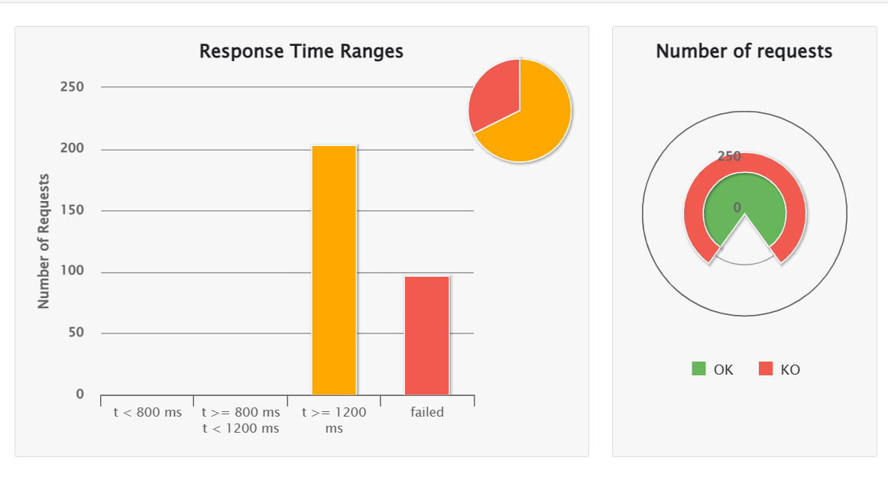
第二次：
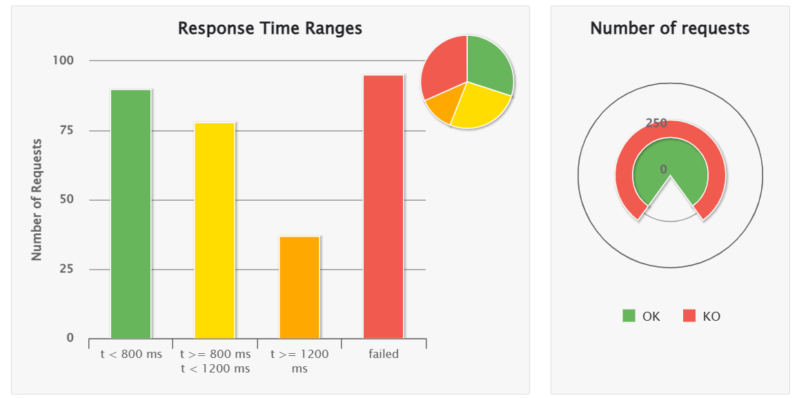
当cpus=2时，使用Gatling进行压力测试，结果如下：
第一次：
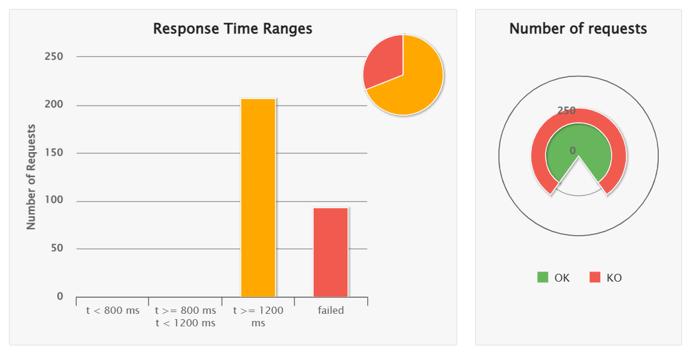
第二次：
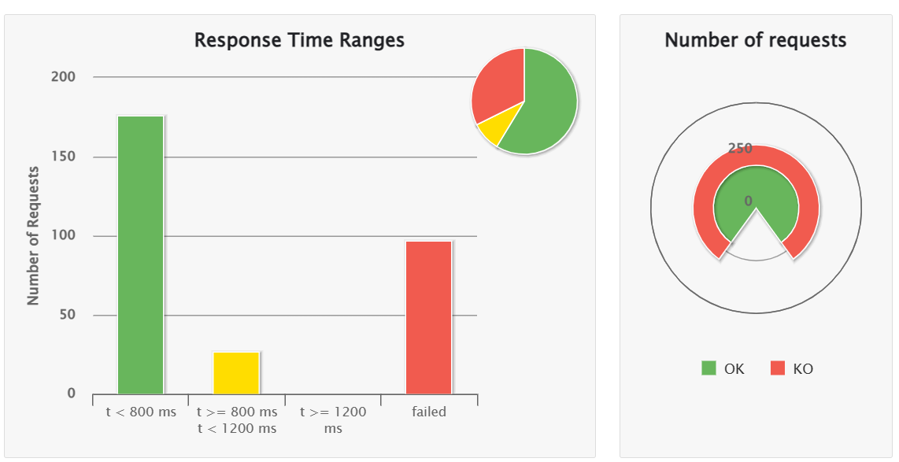
当cpus=3时，使用Gatling进行压力测试，结果如下：
第一次：
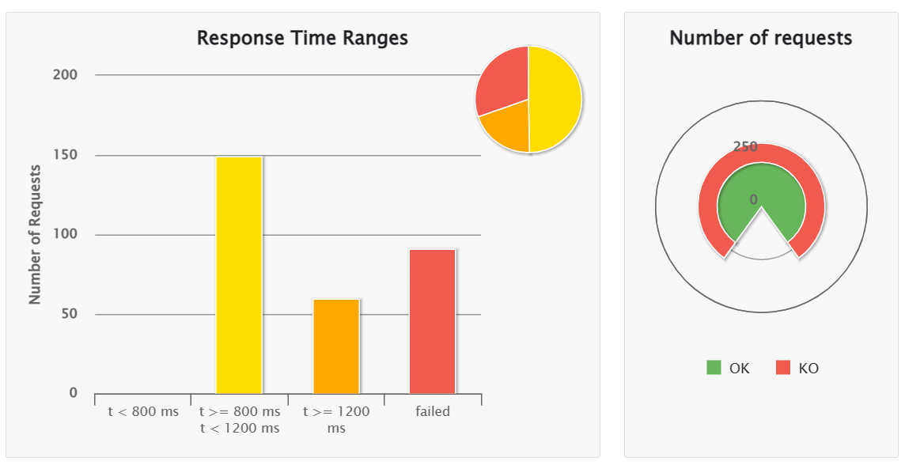
第二次：
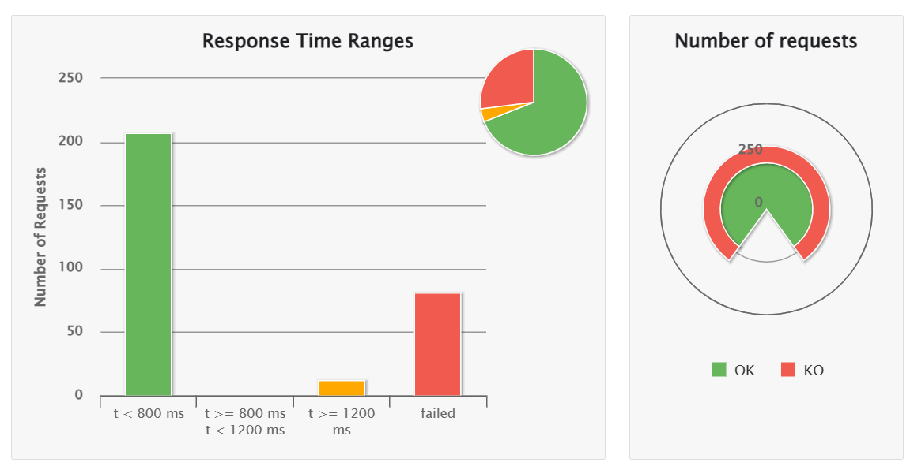
其中每次测试均有300个并发用户，大约有100个请求失效，这是因为在单服务器情况下，Tomcat的线程池只有200，因此无法处理这么多并发请求，导致请求超时，所以每次只有大概200个请求成功。

而每次测试第二次的时延都低于第一次，而第二次之后的表现则基本类似，应该是因为JVM的懒加载及JIT机制，第一次响应时一些类还没有进行加载，导致响应时间较长，而第二次之后就没有这个问题了。


### Make Webpos horizontally scalable by using haproxy and perform load testing against it

使用HAProxy作为负载均衡器，将Webpos部署在四个服务器上，cpus=0.5，并使用Gatling进行压力测试。

压力测试结果如下：
第一次：
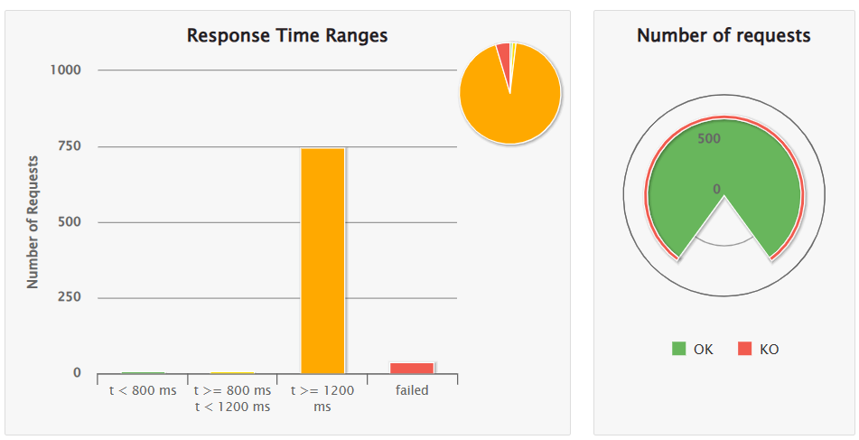
第二次：
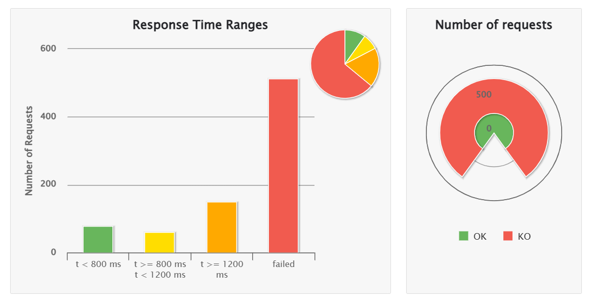
每次测试有800各并发用户，接下来改为300个并发用户进行测试。

结果如下：
第一次：
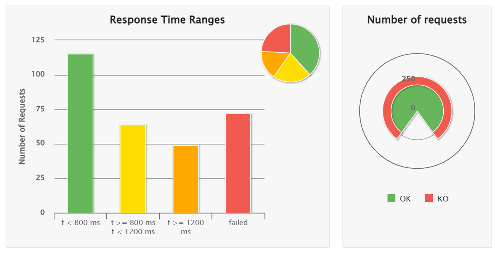
第二次：
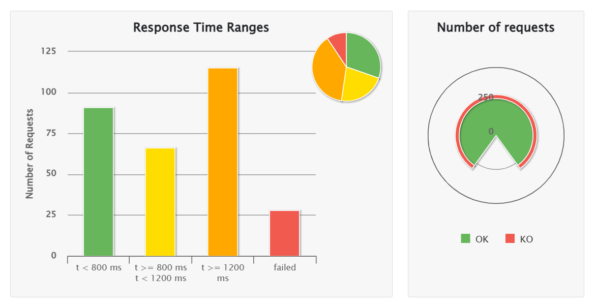

### Redis Cache

使用Redis作为缓存，将商品信息缓存到Redis中，并在每次请求时从Redis中获取数据，避免了每次请求都要向MySQL数据库请求数据，提高了响应速度。

在Edge浏览器观察到的表现如下：
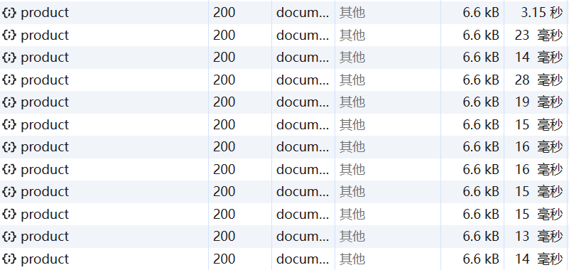
使用Gatling进行压力测试，结果如下：
第一次：
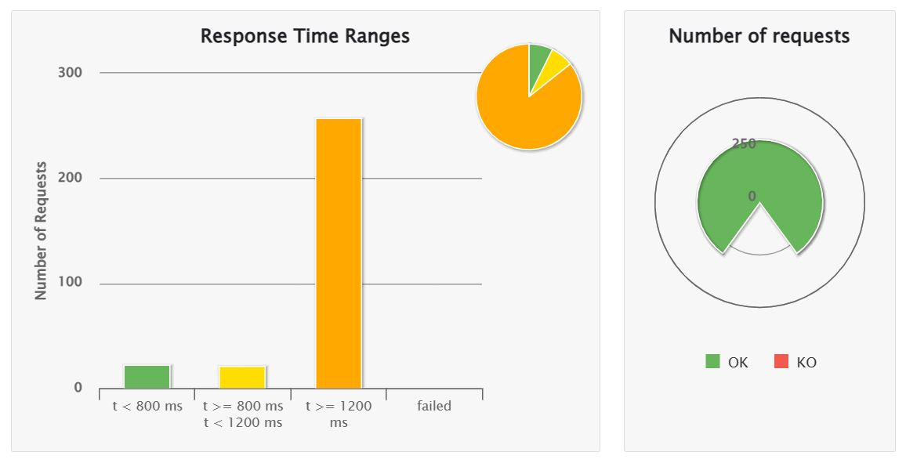
第二次：
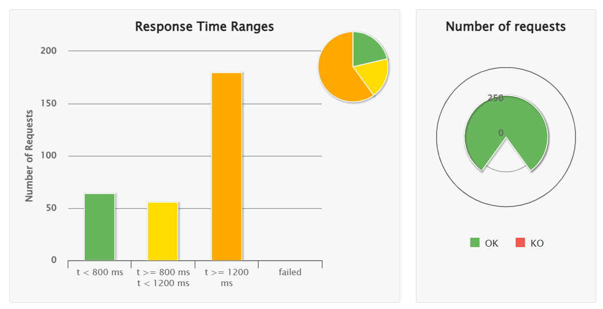
第三次：
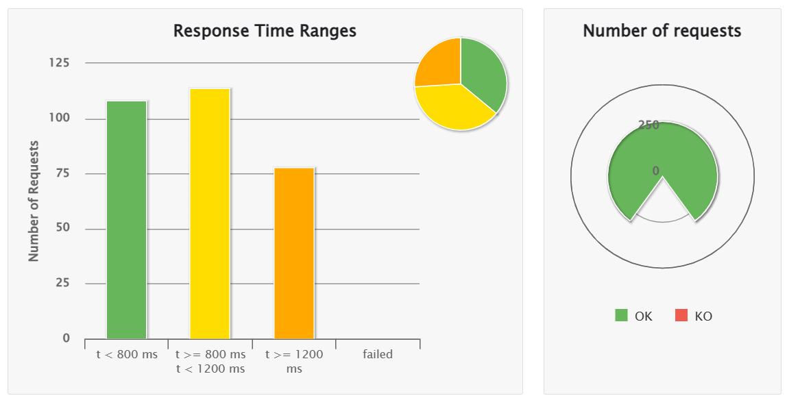

可以明显看到后两次的测试结果都有明显的提升，说明缓存的效果确实很好。

相比于没有缓存，也不再出现请求超时现象，说明缓存的确起到了作用。